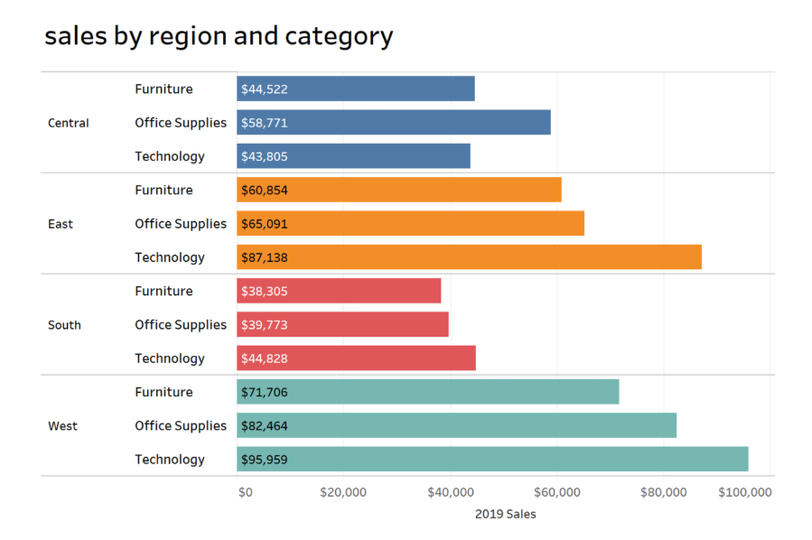
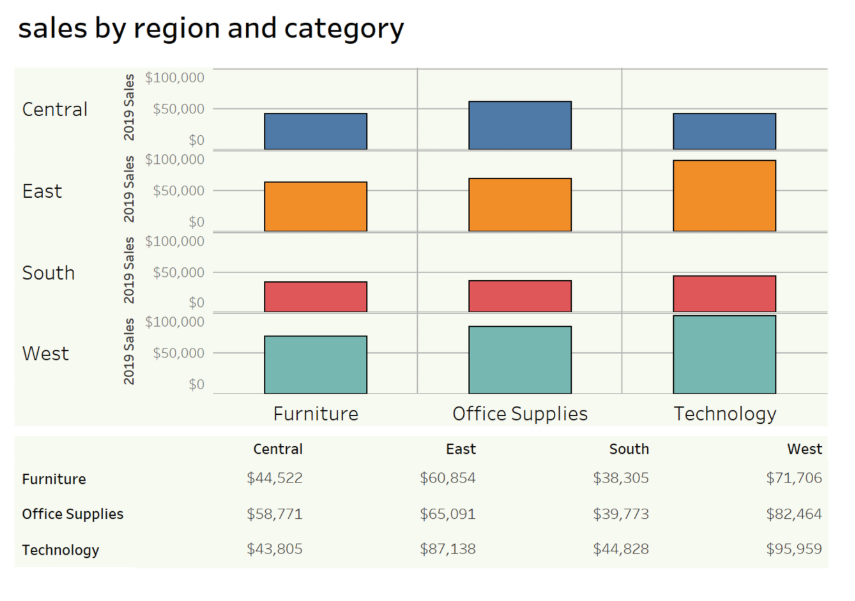

---

title: "hw-02"
author: "Danny Jenkins (S2785798)"
date: "`r Sys.Date()`"
output: html_document

---

```{r setup, include=FALSE}
## **DO NOT EDIT THIS CODE CHUNK**
knitr::opts_chunk$set(echo = TRUE)
library(tidyverse)
```

```{r}
strava_runs <- read_csv("data/strava_runs.csv")
```

```{r}
data_5k_10k <- strava_runs %>%
  mutate(
    event = case_when(
      distance..m. > 4998 & distance..m. < 5015  ~ "5k",
      distance..m. > 9998 & distance..m. < 10015 ~ "10k",
      TRUE ~ NA_character_
    )
  ) %>%
  filter(!is.na(event))
```


## Exercise 1

### Exercise 1a
```{r ex1a, out.width="80%"}
data_5k_10k %>% 
  filter(gender == "M") %>%
  filter(!is.na(average.heart.rate..bpm.)) %>%
  ggplot(aes(x = average.heart.rate..bpm.)) + 
  geom_histogram(bins = 20)
```


```{r summary-stats for M}
summary(subset(strava_runs, gender == "M")$average.heart.rate..bpm.)
```

The distribution is approximately bell shaped. Suggesting the data is roughly symmetric around the mean this can be seen with interquartile values since bot are around 10 bpm away from the mean. This suggests that most male runners heart rates don't deviated massively from the mean. 

### Exercise 1b
```{r ex1b, out.width="80%"}
data_5k_10k %>% 
  filter(gender == "F") %>%
  filter(!is.na(average.heart.rate..bpm.)) %>%
  ggplot(aes(x = average.heart.rate..bpm.)) + 
  geom_histogram(bins = 20)

```
```{r summary-stats for F}
summary(subset(strava_runs, gender == "F")$average.heart.rate..bpm.)
```

The female runners have a higer average heart rate in this data set. But have a lower maximum heart rate when compared to the males.  Additionally, the distribution has two roughly bellshaped curves with  potentially anomalous data in between. 


## Exercise 2


### Exercise 2a
```{r ex2, out.width = "80%"}
r <- read.csv("data/strava_runs.csv")

df <- r %>% filter(!is.na(`distance..m.`) & !is.na(`elapsed.time..s.`)) %>% mutate(Pace=(`elapsed.time..s.`/60)/(`distance..m.`/1000),
       Distance = case_when(
      `distance..m.` >=  4900 & `distance..m.` < 5600 ~ "5K",
      `distance..m.` >= 9900 & `distance..m.` < 10600 ~ "10K",
    ),
    Gender = factor(gender, levels=c("M","F"), labels=c("Male runner","Female runner"))
  ) %>% filter(!is.na(Distance)&!is.na(Gender))

ggplot(df, aes(x=Distance, y=Pace,fill = Distance)) +
  geom_boxplot(na.rm = TRUE) +
  facet_wrap(~Gender) +
  labs(title="Pace plots for 5K and 10K by Gender",
       x="Distance", y="Pace (minutes/km)") +
  theme(plot.title = element_text(hjust = 0.5,size = 12))
```

### Execrise 2b

The median pace for female runners is higher in both the 5k and the 10k runs compared to the males.


## Exercise 3

```{r ex3, out.width = "80%"}
r <- read.csv("data/strava_runs.csv")

df <- r %>%
  filter(!is.na(`distance..m.`) & !is.na(`elapsed.time..s.`)) %>%
  group_by(athlete) %>%                    
  mutate(
    Speed = `distance..m.` / `elapsed.time..s.`,        
    avg_dis = mean(`distance..m.`, na.rm = TRUE),  
    avg_d = case_when(               
      avg_dis/ 1000 > 13 ~ ">13K",
      avg_dis / 1000 < 7  ~ "<7K",
      TRUE ~ "Between 7k and 13k"
    ),
    avg_d = factor(avg_d, levels = c(">13K", "<7K", "Between 7k and 13k"))
  ) %>%
  ungroup() %>%
  filter(avg_d != "Between 7k and 13k")

ggplot(df, aes(x = `distance..m.`/1000, y = Speed, color = avg_d)) +
  geom_point(size = 0.5) +
  geom_smooth(method = lm, se = FALSE) +
scale_color_manual(values = c(">13K" = "orange", "<7K" = "forestgreen"))+
  labs(title = "Speed vs Distance for long and short distance runners",
       x = "Distance (km)",
       y = "Average running Speed (m/s)",
       color = "Run Distance") + 
    theme(plot.title = element_text(hjust = 0.5,size = 12))


```


## Exercise 4

#### Example of a good data visualisation

```{r ex4_good_viz, echo = FALSE, out.width = "80%"}
# edit the file path accordingly

```

**csgsolutions**, "**https://www.csgsolutions.com/**" [Online]. Available at: **https://blog.csgsolutions.com/6-tips-for-creating-effective-data-visualizations** (Accessed: **30th of october 2025**)


The above image presents a good data visualisation because:

1. Easy to read off the data from the chart as the exact amount is written on the graph instead of having to read off the price from the vertical axis. This makes it both efficent and simple to read.

2. Each individual categroy is split into subcategories e.g Central into tech and Furniture. Making it easier to grasp the details of the data. Hence this visualisation gives an accurate account of the data as well as clearly understandable. 


#### Example of a bad data visualisation


```{r ex4_bad_viz, echo = FALSE, out.width = "80%"}
# edit the file path accordingly

```

**csgsolutions**, "**https://www.csgsolutions.com/**" [Online]. Available at: **https://blog.csgsolutions.com/6-tips-for-creating-effective-data-visualizations** (Accessed: **30th of october 2025**)


The above image presents a bad data visualisation because:

1. Inefficient as to read the exact data you have to refer to a separate table. 

2. Graphs are unclear and uneeded since the table gives all the data in a clearer manner here.  

